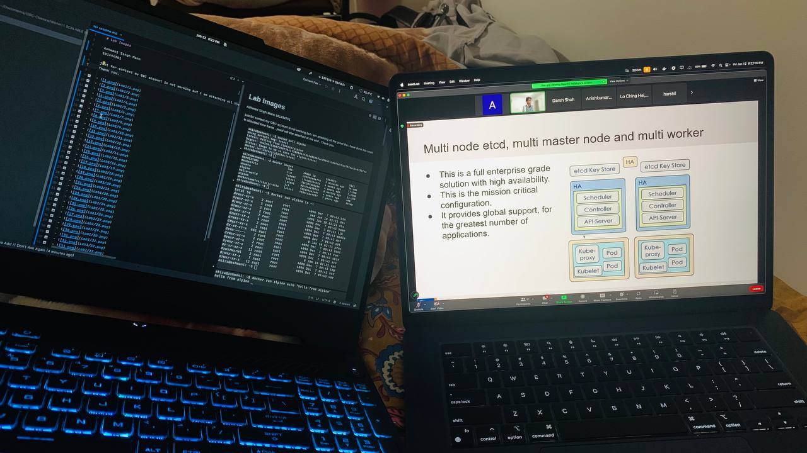

# Lab Images

Ashwani Singh Mann
101494701

just for context my GBC account is not working but i am attacking all the proof tha i have done this work in allocated time frame , proof will is attached at the end .
Thank you.

- 
- 
- 
- 
- 
- 
- 
- 
- 
- 
- 
- 
- 
- 
- 
- 
- 
- 
- 
- 
- 
- 
- 
- 
- 
- 
- 
- 
- 
- 
- 
- 
- 
- 
- 

Proof of work done and submitted during the class session around 8.23pm

- 
