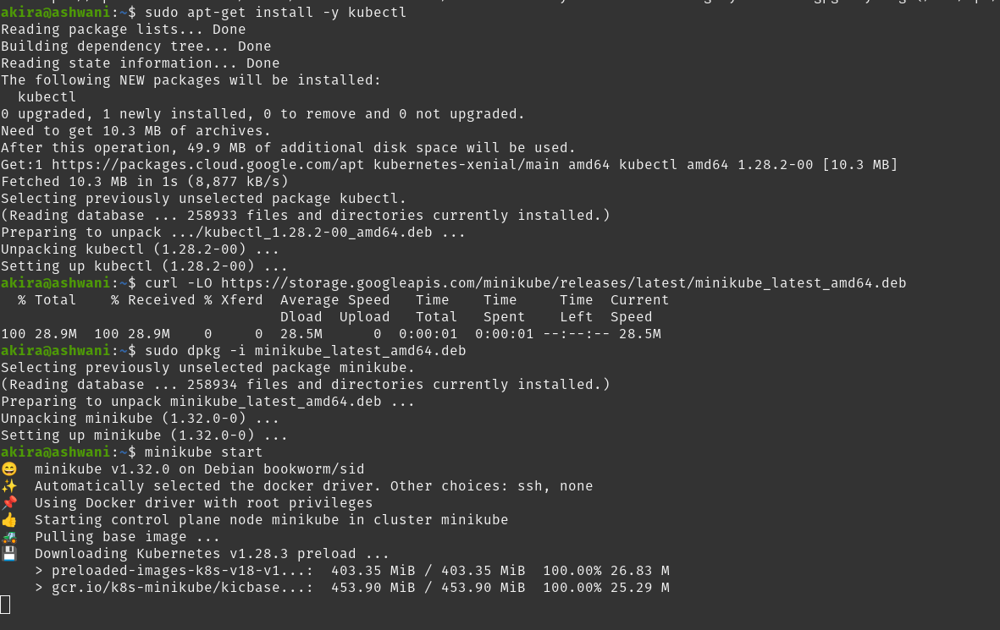
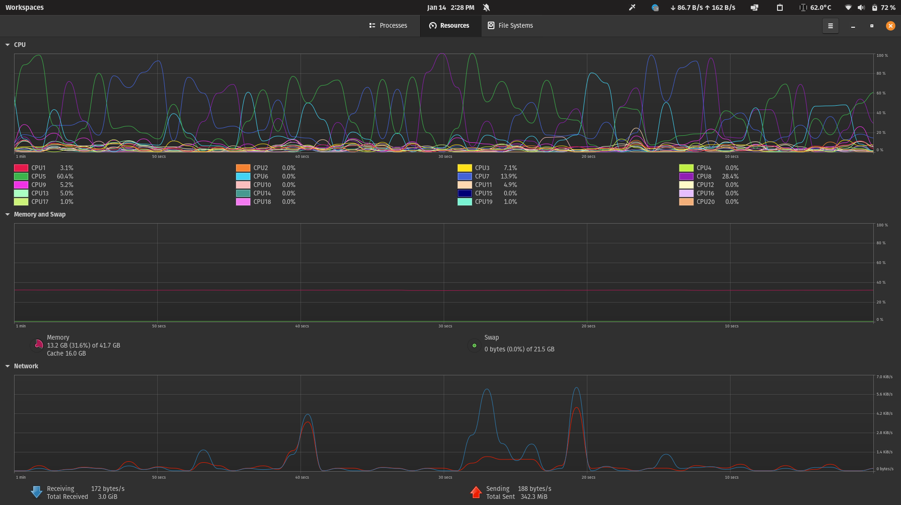

# Lab Images

Ashwani Singh Mann
101494701

[Watch the Video](https://www.youtube.com/watch?v=XFeW_ZBwsg0)

- 
- 
- 

Thank you.

Understand what kubernetes doesnt do from here

K8s is orchestration for docker container, we can host our full stack app here which can manage all for us like networking, load balancing,monitoring, auto scalling, and much more 
we can pre decsribe the what functionlity we want in our docker file, it will behave exaclty same
if any container goes down insidea pod it will keep replica of it and make it up again which losisng the
data of that

What other Orchestration tools are available other than Kubernetes

Openshift
Hasicorp Nomad
Docker Swarm
Rancher
Google Container Engine (GKE)
AWS Elastic Kubernetes Service
Azure Managed Openshift Service
