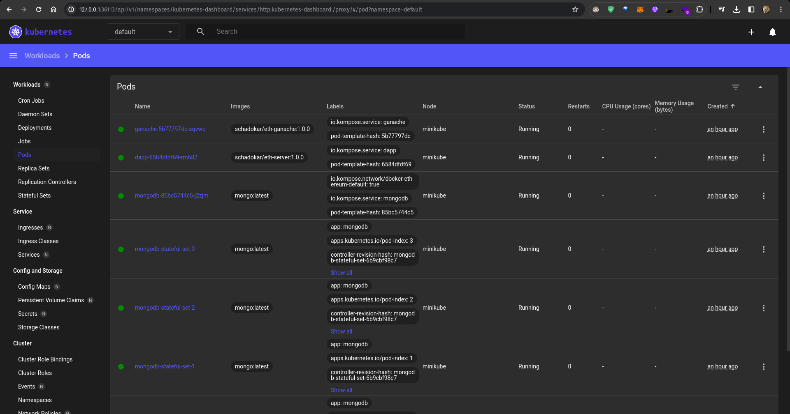
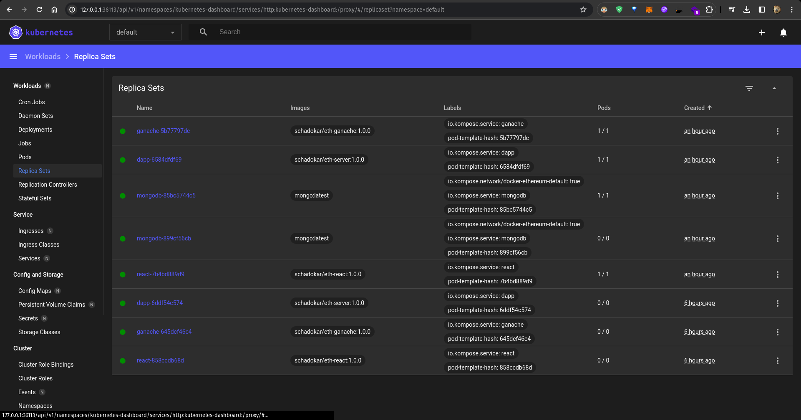
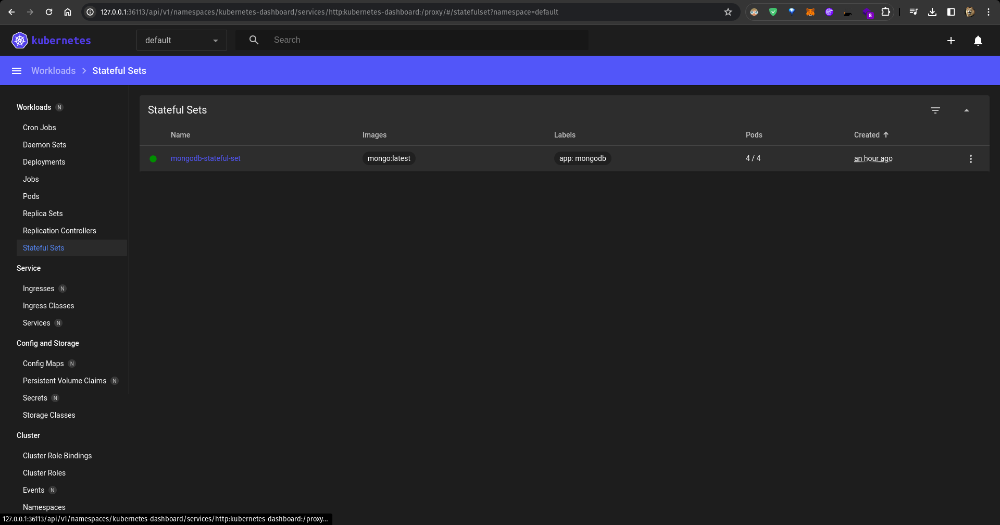
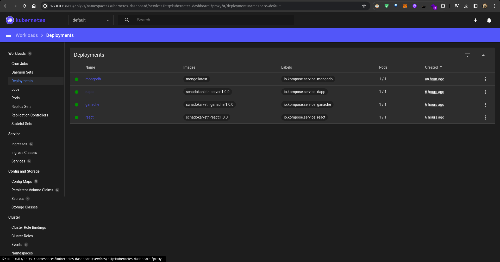
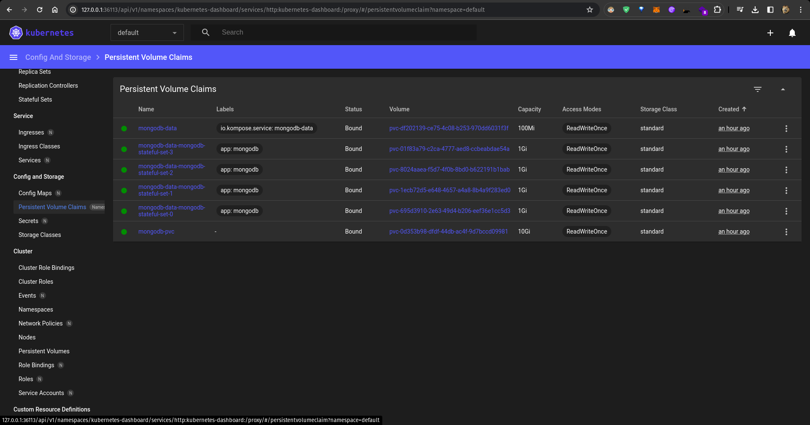
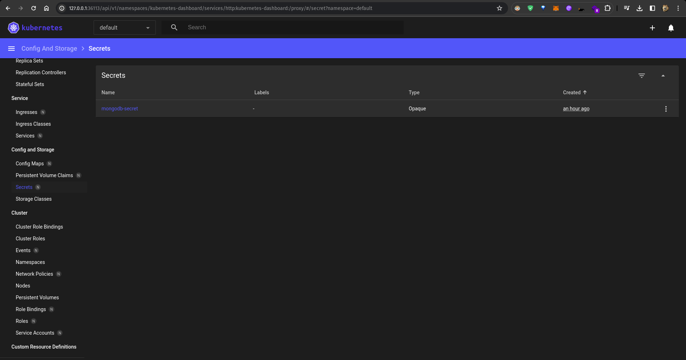
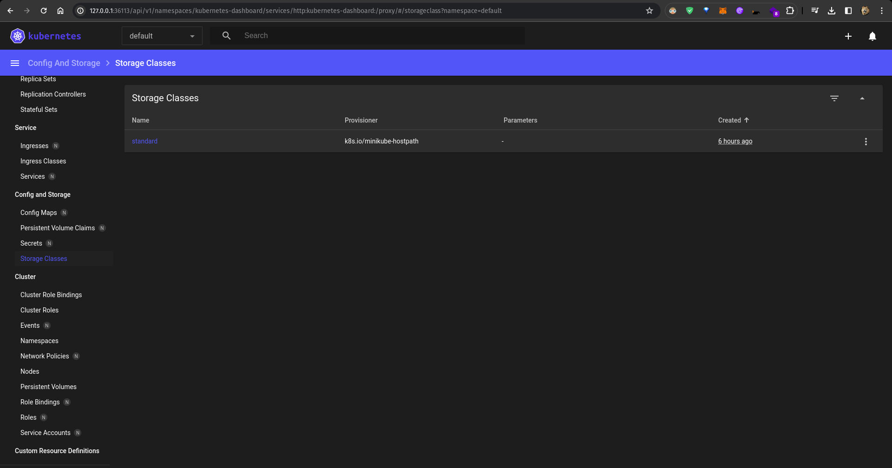
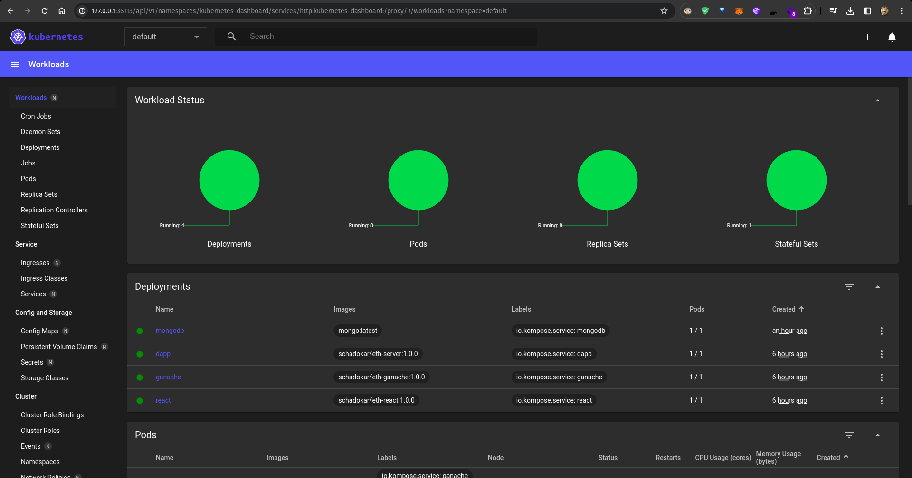
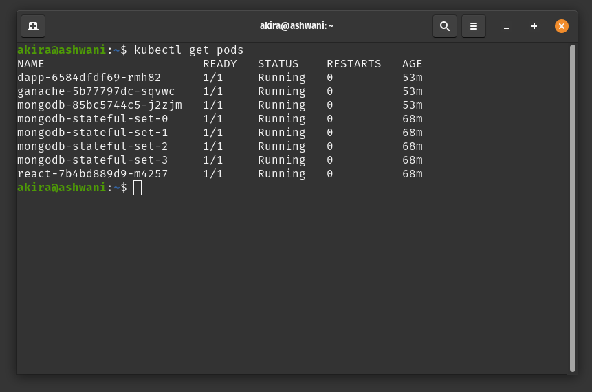

DApp Deployment:
-----------------

Create a Kubernetes Deployment for your DApp with 1 replica set.
Expose the DApp service using a NodePort Service type to make it accessible externally.
Set up Horizontal Pod Autoscaling (HPA) for the DApp with a minimum of 2 replicas and a maximum of 4 replicas.

MongoDB Deployment:
--------------------
Create a StatefulSet for MongoDB with 1 replica set and a minimum availability of 1.
we needed to save the message from setMesage from the  frontend thats why used statefulset
Configure a PersistentVolumeClaim (PVC) for MongoDB to ensure data persistence.
Use a NodePort Service type for MongoDB to allow external access if needed.\

Ganache Deployment:
-------------------------
Deploy Ganache using a Kubernetes Deployment with 1 replica set.
Expose Ganache service using a NodePort Service type for external access.

React Deployment & HorizontalPodAutoscaler:
---------------------------------------------
Deploy React application using a Kubernetes Deployment with 1 replica set.
Expose React service using a NodePort Service type for external access.
Set up an HPA for the React application to scale based on CPU or other metrics as required.
Configure the HPA with a minimum of 1 replica and a maximum of 3 replicas.

Architecture
---------------

- 
- 
- 
- 
- 
- 
- 
- 
- 
- 
